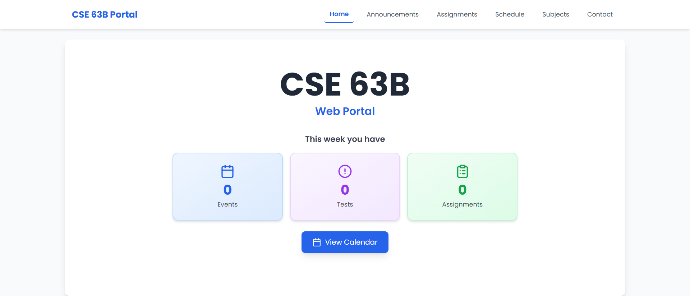
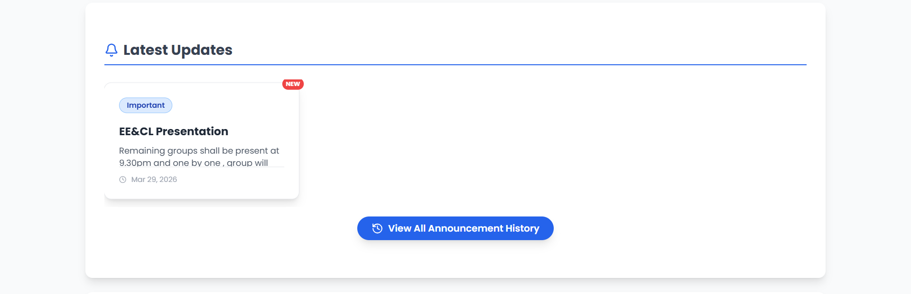
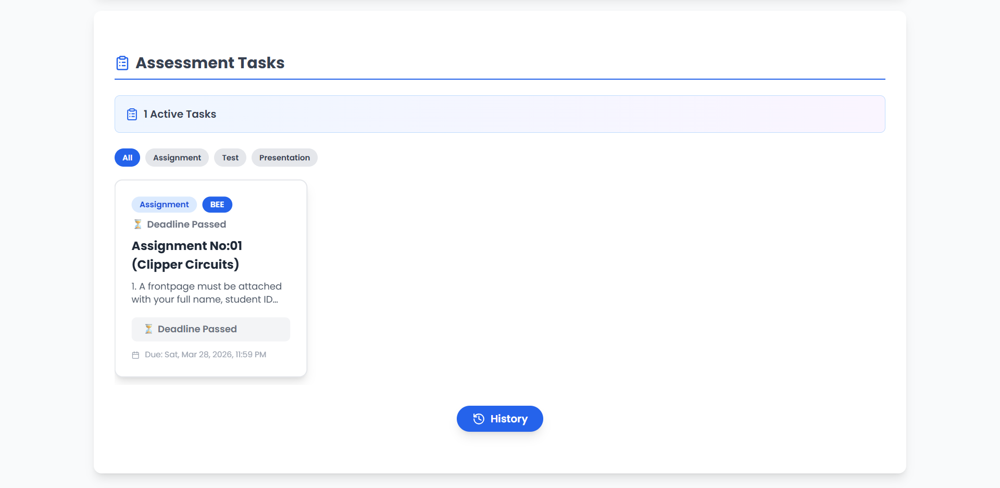
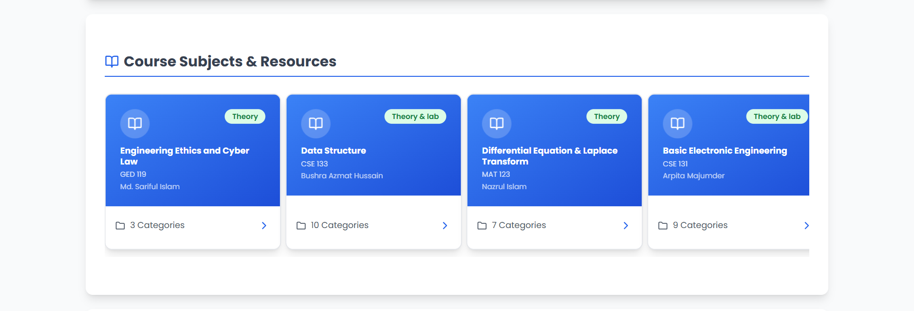
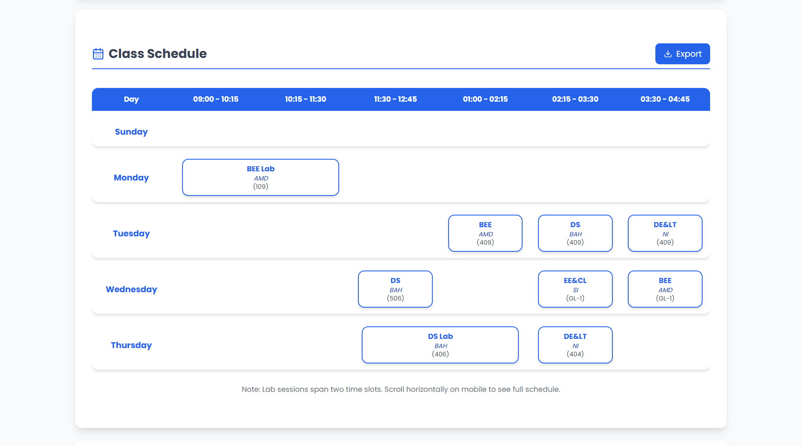
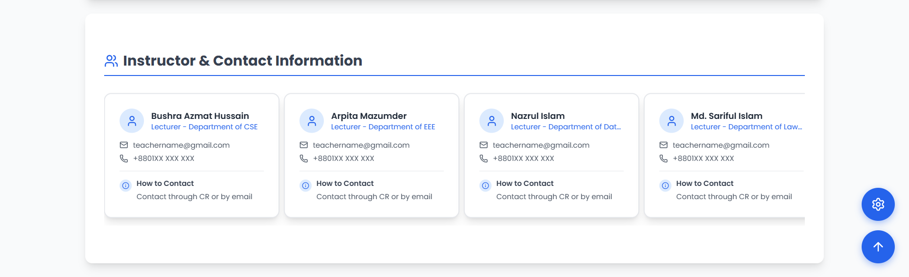

# CSE 63B Class Portal

A comprehensive, fully dynamic class portal and administrative dashboard built with a Vanilla JavaScript frontend, styled with Tailwind CSS, and powered by Firebase Firestore as its backend database.

This portal acts as a centralized digital classroom hub to serve students the latest course materials, assignments, announcements, and scheduling details, all managed securely through an intuitive admin panel.

---

## 📚 Main Portal Features (`index.html`)

The main portal handles the student experience. It features a modern, responsive, component-driven design with horizontal scrolling sections, dynamic modal overlays, and visual feedback that updates instantly.

### 1. Dynamic Updates Banner
- Listens for timestamp changes in Firestore. When the admin updates the portal, an "Update Available" banner slides down allowing the student to fetch the new data without unexpectedly losing their current state.

### 2. Interactive Calendar
- Provides a monthly and weekly layout view to visualize upcoming events, tests, and holidays.
- Calculates dynamic weekly statistics to highlight upcoming coursework directly from Firebase entries.

### 3. Latest Announcements

- A horizontal scroll view of the most recent broadcasts, marked with colorful tags (e.g. Notice, Update).
- **History Modal:** A button that pulls up a full historical archive of all announcements securely filtered from Firebase.

### 4. Assessment Tasks (Assignments)

- Displays active assignments with visual urgency markers (e.g., `< 24h left`, `Past Due`).
- Features a live countdown timer ticking down to active deadlines.
- **Filter Tabs:** Quickly sort between "All", "Assignment", "Test", and "Presentation".
- **Dynamic Action Card:** Clicking an assignment opens a detailed modal loaded with categorized attachments/links provided by the teacher.

### 5. Subject Resources

- Lists fundamental subjects for the semester.
- Each subject card shows its type (Theory / Lab) and its primary teacher.
- **Resource Modals:** Opening a subject card triggers a specialized modal where categorized files (Books, Slides, Past Papers) and the main Google Drive folder link are accessible.

### 6. Course Schedule

- Clean, grouped daily breakdowns (Sunday-Thursday) of timeslots.
- Tags identify Theory vs. Lab sessions and include current Room allocations.

### 7. Instructor Contacts

- Interactive cards populated with staff names, designations, profile images, and precise contact instructions.
- Provides immediate clickable links for `mailto:` and `tel:`.

---

## ⚙️ Admin Dashboard Features (`admin.html`)

The admin panel is a secure, authenticated back-office enabling instructors or class representatives to manage the entire portal dynamically without touching the codebase.

### 1. Secure Authentication & Dashboard
- Protected by Firebase Auth. Includes brute-force protection (lockout timers) for repeated failed attempts.
- **Live Statistics:** At a glance, the dashboard provides numeric summaries across all categories (Active Assignments, Total Subjects, etc.).

### 2. Unified Content Management System (CMS)
Administrators can easily jump between six core sections using the navigation tab (Calendar, Announcements, Assignments, Subjects, Schedule, Contacts) to manage their respective data. No raw database tweaking is required.

### 3. Dynamic Form Editor
- Adding or editing items operates through a centralized Modal Editor.
- The editor adapts its form fields smartly based on the active section. Examples include:
    - **Assignments:** Attach multiple URLs or files directly to a deadline.
    - **Schedule:** Pick standardized block timeslots, day, and Theory/Lab type.
    - **Subjects:** Deep categorization feature allows the admin to infinitely add nested resources (e.g., adding 5 URLs under a "Midterm Slides" category).

### 4. Bulk Actions & Archival
- Every list item supports checking via a bulk toggle.
- When multiple items are selected, a floating bottom action bar appears allowing the admin to **Delete** or **Archive** items seamlessly in batches.

### 5. Google Integrations (Apps Script Syncs)
- **Google Classroom (GCR) Sync:** Features a direct integration bridge. The dropdown for configuring 'Subjects' imports live Google Classroom names to establish auto-sync relationships.
- **Google Drive Sync:** Admins can insert a direct URL for dynamically pushing visual schedule exports out to the frontend.

### 6. Background Audit Logging
- Every create, update, or delete action taken through the CMS runs a parallel request to track the action in an `audit_log` Firestore collection (recording the user's email, timestamp, and modification details) ensuring absolute traceability.

---

## 🛠 Tech Stack

- **Frontend:** HTML5, Vanilla JavaScript (`portal-engine.js`, `admin.js`), Tailwind CSS (via CDN), Lucide Icons.
- **Backend:** Firebase Firestore (NoSQL database).
- **Authentication:** Firebase Auth (Email/Password).
- **Hosting:** Firebase Hosting.
- **API Enhancements:** Google Apps Script (Drive/Classroom data bridges).
